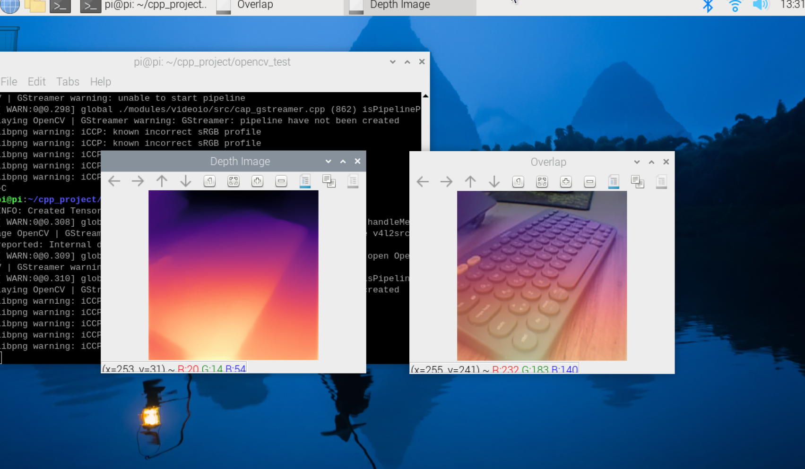
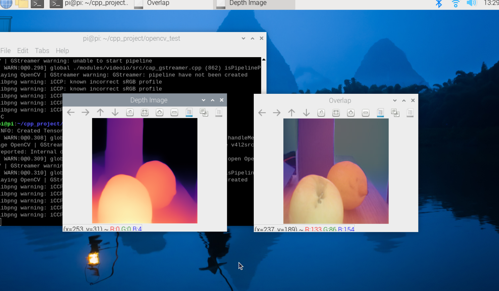

# MiDaS-v2.1-small-cpp

## Table Of Contents

1. About
2. Results
3. Installation
4. References

## 1. About the Project

 A Monocular depth estimation with MiDAS, TensorFlow Lite and OpenCV on The Raspberry Pi 4. All in C++.

Here I used the v2.1 small MiDAS model which is the best in performance. [See MiDAS Source Code](https://github.com/isl-org/MiDaS).

 This is a part of my bachelor's diploma project ["Making an Autonomous Car with Depth Estimation"]().  

## 2. Results

This project is tested on Raspberry Pi 4 Model B with 4 GB RAM with the 64-bit Ubuntu 22.04. Used a 3A power supply and without overclocking. Here are the results:

| Device         | RAM  | OS     | Multithread(All) Performance | Single Thread Performance |
| -------------- | ---- | ------ | ---------------------------- | ------------------------- |
| Raspberry Pi 4 | 4 GB | Ubuntu | ~ 2.14 FPS                   | ~ 0.91 FPS                |
#



## 3. Installation and Execution

| Library         | Version |
| --------------- | ------- |
| TensorFlow Lite | v2.12.0 |
| OpenCV          | v4.6.0  |

Here how the directory tree should look like:

```
.
├── CMakeLists.txt
├── lib
│   ├── flatbuffers_include
│   │   └── flatbuffers
│   │       └── ...
│   ├── midas_cpp
│   │   ├── CMakeLists.txt
│   │   ├── midas.cpp
│   │   └── midas.h
│   ├── tensorflow_include
│   │   └── ...
│   └── tensorflow_src
│       └── ...
├── opencv_example
│   ├── CMakeLists.txt
│   ├── models
│   │   └── midasModel.tflite
│   └── opencv_example.cpp
└── README.md
```

### TensorFlow Lite

---
To include the library, you only can compile it by [Source File](https://github.com/tensorflow/tensorflow). According to [TensorFlow Lite Documentation](https://www.tensorflow.org/lite/guide), currently can be compiled by CMake and Bazel. I do not recommend doing it in the device itself, you can cross-compile instead. Also, the CMake installation has some problems, so Bazel is the only choice. You can simply pull [the Docker TensorFlow Image](https://hub.docker.com/r/tensorflow/tensorflow/). It comes with installed Bazel and a downloaded Tensorflow source file. After compiling, move the compiled directory to your device then you will able to include to CMake as a shared library.

Here is [the Cross-compile Documentation](https://www.tensorflow.org/lite/guide/build_cmake_arm).

#### Preparing Headers for The TensorFlow Lite

>You can find a shared library in: bazel-bin/tensorflow/lite/libtensorflowlite.so.
>
>Currently, there is no straightforward way to extract all header files needed, so you must include all header files in tensorflow/lite/ from the TensorFlow repository. Additionally, you will need header files from FlatBuffers and Abseil.

*[- From  TensorFlow Lite for ARM boards](https://www.tensorflow.org/lite/guide/build_arm)*

To extract all header files from the source I added [the script](source2include.sh) that does exactly it.

Example Usage:

```
$ ./source2include.sh   your_source_directory_name   extracted_directory_name
```

Extracting files:

```
$ ./source2include.sh   tensorflow_src  tensorflow_include 
```

After, you need to clone the flatbuffer repository to include their header files too. We need only the include directory in the flatbufffer source file, 

```bash
$ git clone https://github.com/google/flatbuffers.git # FlatBuffer Repository
```

Rename the include file to flatbuffer_include. Then place the include directory alongside the project as shown above.

### OpenCV

---

Currently (11.20.2023), you can simply install dynamic libraries from apt:

```bash
$ sudo apt install libopencv-dev
```

In another way, you can also compile it from the source. Here the [documentation](https://docs.opencv.org/4.x/d7/d9f/tutorial_linux_install.html)

After successful installation place the dependencies as shown on the directory tree.

### Compile and Execute

Make the build directory

```
$ mkdir build
$ cd build
```

Compile 

```
$ cmake ..
$ make
```

 Make the binary executable

```
$ sudo chmod +x build/opencv_example/opencv_example
```

Now execute

```bash
$ sudo ./build/opencv_example/opencv_example # Here you should use sudo to able to access the camera.
```

